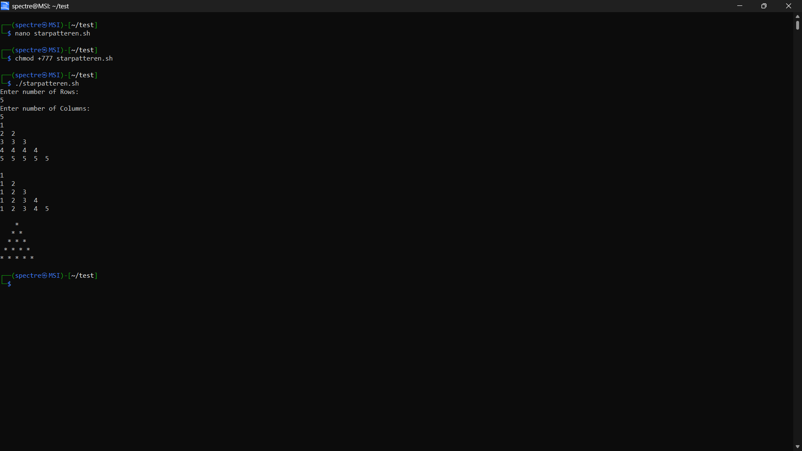

# Operating System Course - Day 01

[](https://learn.microsoft.com/en-us/windows-server/administration/windows-commands/windows-commands)
[](https://www.microsoft.com/windows)
[]()
[]()

> 📚 A comprehensive collection of daily practical lessons for Operating System course focusing on pattern programs and scripting exercises.

## 📋 Course Overview

This repository contains practical exercises and implementations for the Operating System course. Each lesson is organized with batch scripts and their corresponding outputs.

## 🗓️ Day 01 Content

### 🎯 Pattern Programs

#### Pattern 1: Number Triangle (Repeating Row Numbers)
```
1
2 2
3 3 3
4 4 4 4
5 5 5 5 5
6 6 6 6 6 6
```

#### Pattern 2: Number Triangle (Sequential Numbers)
```
1
1 2
1 2 3
1 2 3 4
1 2 3 4 5
1 2 3 4 5 6
```

#### Pattern 3: Star Triangle
```
    *
   * *
  * * *
 * * * *
* * * * *
```

### 💻 Code Implementation

```bash
# Pattern Generation Logic
for ((i=1; i<=rows; i++))
do
    # Pattern 1: Repeating row numbers
    for ((j=1; j<=i; j++))
    do
        echo -n "$i "
    done
    echo ''
done

# Pattern 2: Sequential numbers
for ((i=1; i<=rows; i++))
do
    for ((j=1; j<=i; j++))
    do
        echo -n "$j "
    done
    echo ''
done

# Pattern 3: Star pyramid
for ((i=1; i<=rows; i++))
do
    # Print spaces
    for ((k=1; k<=rows-i; k++))
    do
        echo -n " "
    done

    # Print stars
    for ((j=1; j<=i; j++))
    do
        echo -n "* "
    done
    echo ""
done
```

### 📊 Pattern Outputs

| Pattern Type | Description | Visual Output |
|----------|-------------|---------------|
| Number Triangle 1 | Pattern with repeating row numbers |  |


### 🔍 Code Explanation

1. **Number Triangle (Pattern 1)**
   - Uses nested loops to create rows and columns
   - Outer loop (i) controls the number of rows
   - Inner loop (j) prints the current row number 'i' times

2. **Sequential Numbers (Pattern 2)**
   - Similar structure to Pattern 1
   - Inner loop prints numbers from 1 to current row number
   - Creates an increasing sequence in each row

3. **Star Triangle (Pattern 3)**
   - Uses three nested loops for spaces and stars
   - First inner loop prints required spaces
   - Second inner loop prints stars with spacing
   - Creates a centered pyramid pattern


### 🔍 Technical Notes

- Implementation uses Bash scripting for pattern generation
- Each pattern demonstrates different loop control structures
- Proper spacing and formatting ensure clean visual output
- Code includes comments for better understanding

---

<div align="center">

📖 **Learning Path** | 🛠️ **Practical Examples** | 📊 **Visual Outputs**

</div>
